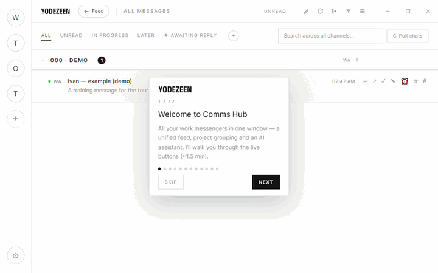
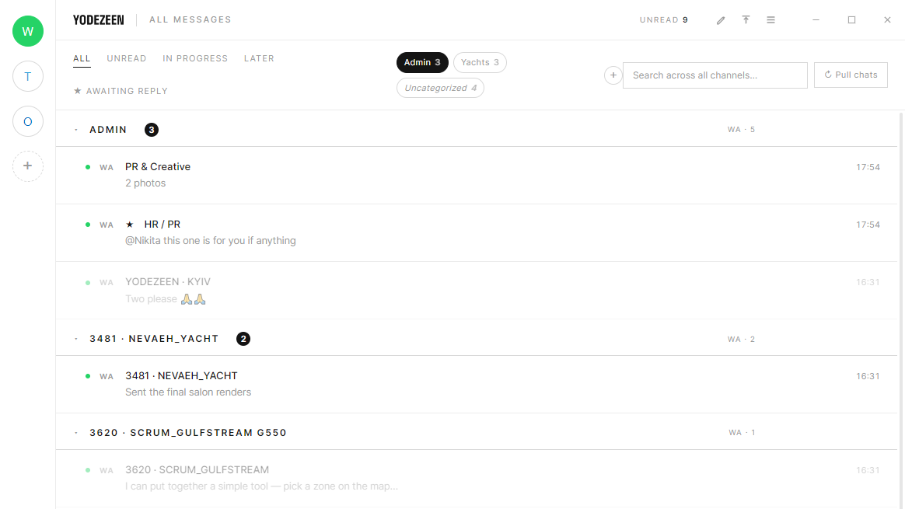

# Comms Hub

The studio's work messengers in one window: WhatsApp, Telegram, Outlook, Teams (and any web service as a channel). On top — a unified inbox feed grouped by project, with search, categories and an AI assistant.

### A guided tour on first launch

## Download

Get **`Comms-Hub-Setup-<version>.zip`** from the **[latest release](https://github.com/OneOfApes/comms-hub-releases/releases/latest)** — a `.zip` download avoids the SmartScreen "isn't commonly downloaded" banner that a bare `.exe` triggers. (The raw `.exe` is also attached — it's what the built-in auto-updater uses.)

Windows 10/11, 64-bit. After install the app updates itself: app code over-the-air automatically, the core via a new installer only rarely.

## Install

1. Download and unzip `Comms-Hub-Setup-<version>.zip`.
2. Run `Comms-Hub-Setup-<version>.exe`. If Windows shows «protected your PC» (the app is not yet code-signed) → **More info** → **Run anyway**.
3. Data is stored in `%APPDATA%\CommsHub` (the folder can be changed in Settings).

## Features

- WhatsApp / Telegram / Outlook channels in one window; add your own web services.
- Unified inbox feed; grouping by project code and custom categories.
- Pull existing chats into the feed; new messages highlighted on launch.
- Background mode (tray), autostart, native notifications.
- AI assistant: formalize and draft replies using the chat context.
- Dark theme; interface in Ukrainian / English / Russian.

## Support

Internal tool of YODEZEEN studio. The source code lives in a private repository; only builds are published here.
